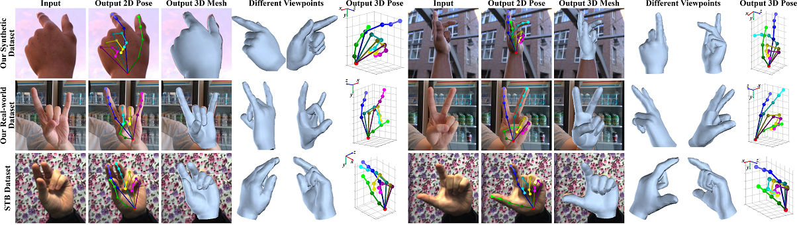

## 3D Hand Shape and Pose Estimation from a Single RGB Image
Open source of our CVPR 2019 paper "3D Hand Shape and Pose Estimation from a Single RGB Image"



### Introduction
This work is based on our [CVPR 2019 paper](https://docs.google.com/viewer?a=v&pid=sites&srcid=ZGVmYXVsdGRvbWFpbnxnZWxpdWhhb250dXxneDo3ZjE0ZjY3OWUzYjJkYjA2). You can also check our [project webpage](https://sites.google.com/site/geliuhaontu/home/cvpr2019) and [supplementary video](https://youtu.be/NActf7FcrmI) for a deeper introduction.

This work addresses a novel and challenging problem of estimating the full 3D hand shape and pose from a single RGB image. Most current methods in 3D hand analysis from monocular RGB images only focus on estimating the 3D locations of hand keypoints, which cannot fully express the 3D shape of hand. In contrast, we propose a Graph Convolutional Neural Network (Graph CNN) based method to reconstruct a full 3D mesh of hand surface that contains richer information of both 3D hand shape and pose. To train networks with full supervision, we create a large-scale synthetic dataset containing both ground truth 3D meshes and 3D poses. When fine-tuning the networks on real-world datasets without 3D ground truth, we propose a weakly-supervised approach by leveraging the depth map as a weak supervision in training. Through extensive evaluations on our proposed new datasets and two public datasets, we show that our proposed method can produce accurate and reasonable 3D hand mesh, and can achieve superior 3D hand pose estimation accuracy when compared with state-of-the-art methods.

### Citation
If you find our work useful in your research, please consider citing:

	@inproceedings{ge2019handshapepose,
	  title={3D Hand Shape and Pose Estimation from a Single RGB Image},
	  author={Ge, Liuhao and Ren, Zhou and Li, Yuncheng and Xue, Zehao and Wang, Yingying and Cai, Jianfei and Yuan, Junsong},
	  booktitle={CVPR},
	  year={2019}
	}

### Installation
1. Install pytorch >= v0.4.0 following [official instruction](https://pytorch.org/).
2. Clone this repo, and we'll call the directory that you cloned as ${HAND_ROOT}.
3. Install dependencies:
    ```
    pip install -r requirements.txt
    ```

### Pre-trained models
~~Download pre-trained models from [online drive](https://mega.nz/#!yfZXBayC!izaLXi4X8LsgPuRWqKlUrCKBWNLVKTvfgAuFIS7SSFY), and unzip the file to ${HAND_ROOT}/model.~~

### Running the code
1. Evaluate on our real-world dataset and visualize the results of hand mesh and pose.
    ```
    python eval_script.py --config-file "configs/eval_real_world_testset.yaml"
    ```
   The visualization results will be saved to ${HAND_ROOT}/output/configs/eval_real_world_testset.yaml/

2. Evaluate on STB dataset.

    Download [STB dataset](https://www.dropbox.com/sh/ve1yoar9fwrusz0/AAAfu7Fo4NqUB7Dn9AiN8pCca?dl=0) to ${HAND_ROOT}/data/STB.
    
    Run the following script:
    ```
    python eval_script.py --config-file "configs/eval_STB_dataset.yaml"
    ```
   The pose estimation results will be saved to ${HAND_ROOT}/output/configs/eval_STB_dataset.yaml/pose_estimations.mat
