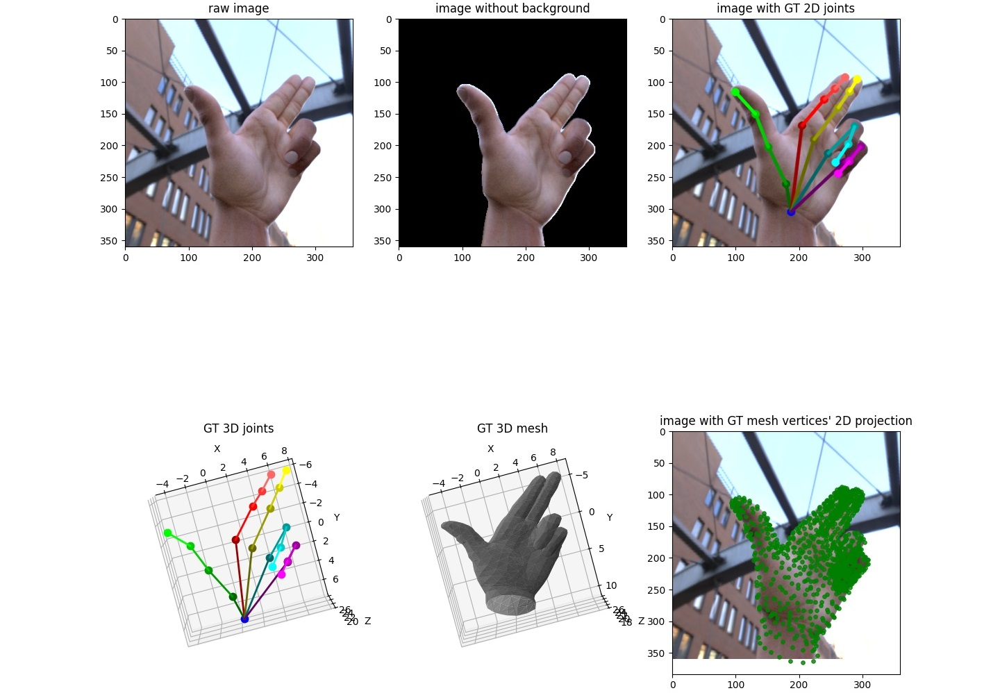
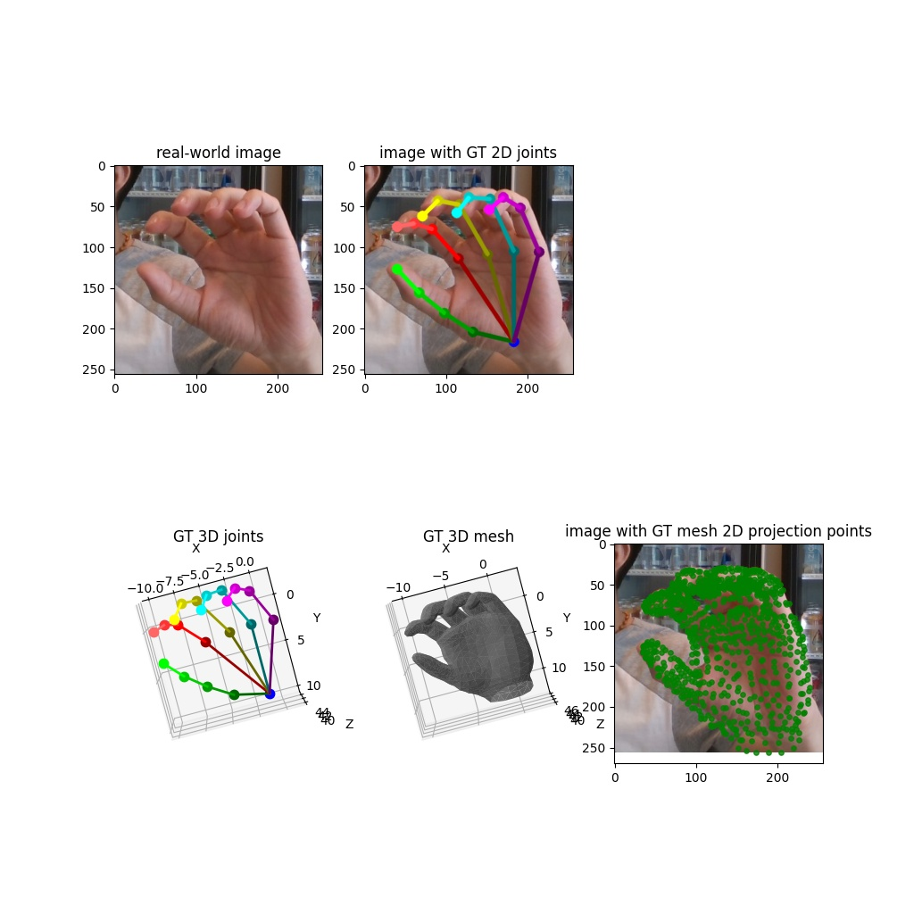

## 3D Hand Shape and Pose Dataset
3D Hand Shape and Pose Dataset of CVPR 2019 paper "3D Hand Shape and Pose Estimation from a Single RGB Image" 
[[paper](https://docs.google.com/viewer?a=v&pid=sites&srcid=ZGVmYXVsdGRvbWFpbnxnZWxpdWhhb250dXxneDo3ZjE0ZjY3OWUzYjJkYjA2)] 
[[demo](https://youtu.be/NActf7FcrmI)] 
[[source code](https://github.com/3d-hand-shape/hand-graph-cnn)]

### Introduction
We create a large-scale synthetic hand shape and pose dataset that provides the annotations of 
both 3D hand meshes and 3D hand joint locations. In addition, we create a real-world hand shape and pose dataset 
dataset containing real-world hand RGB images with the annotations of 3D hand meshes and 3D hand joint locations.

### Citation
If you use this dataset in your research, please cite:

	@inproceedings{ge2019handshapepose,
	  title={3D Hand Shape and Pose Estimation from a Single RGB Image},
	  author={Ge, Liuhao and Ren, Zhou and Li, Yuncheng and Xue, Zehao and Wang, Yingying and Cai, Jianfei and Yuan, Junsong},
	  booktitle={CVPR},
	  year={2019}
	}

## 1. Synthetic image train/validation set
### Data preparation
##### Download image data: 
   - Before downloading the large dataset, you can first download the small image dataset from 
   [sanity_check_images.zip (157MB)](https://drive.google.com/file/d/1ijoZL5Gh_bIj3yEG_ZboA4qnh3h8Suyf/view?usp=sharing) 
   for sanity check. Extract the zip file and put the folders (`l01`, `l21`) into `${HAND_ROOT}/data/synthetic_train_val/images/`. 
   To complete the sanity check, 
   you also need to [download the mesh data](https://github.com/3d-hand-shape/hand-graph-cnn-dataset-private/tree/master/data#download-mesh-data), 
   then [run the example code](https://github.com/3d-hand-shape/hand-graph-cnn-dataset-private/tree/master/data#run-example-code).
   - Download all the image data from 
[part1 (13.8GB)](https://drive.google.com/drive/folders/1IVZpWjEQ6UyBazzfpUCE-hpI6nfeQDUV?usp=sharing), 
[part2 (14.7GB)](https://drive.google.com/drive/folders/17Cthv0q6WlD131MdmShLMop8dzmgVlJB?usp=sharing), 
[part3 (14.1GB)](https://drive.google.com/drive/folders/1huBEaARfNbA-a8s_eIPRD39RX9Arehoy?usp=sharing), 
[part4 (6.2GB)](https://drive.google.com/drive/folders/1AmlcNnkCpViJYCOKhbMgXYam0L8jHJ7z?usp=sharing).
Extract all the zip files and put all the folders (`l01`, `l02`, ..., `l30`) into `${HAND_ROOT}/data/synthetic_train_val/images/`.

##### Download mesh data: 
- Download mesh data from
[hand_3D_mesh.zip (37.8MB)](https://drive.google.com/file/d/1uNM6LWP1auX-KsGDBHDYx4lZF53XAMrQ/view?usp=sharing).
Extract the zip file and put all the obj files into `${HAND_ROOT}/data/synthetic_train_val/hand_3D_mesh/`.

### Data description

- **Images**: In this dataset, we render images with 30 lightings (`l01`, `l02`, ..., `l30`). 
Each lighting folder has 25 cameras (`cam01`, `cam02`, ..., `cam25`). Each camera folder contains images from 500 gestures. 
Each image has 4 channels that are RGB channels and alpha channel. 
The alpha channel (4-th channel) in our dataset saves the hand mask. 
All the images have been cropped so that hand is at the center of the image.

- **Cameras**: Camera parameters are saved in `${HAND_ROOT}/data/synthetic_train_val/3D_labels/camPosition.txt`. 
This file saves 25 cameras' intrinsic and extrinsic parameters for 500 gestures. Each row has seven values, 
which are focal length, 3D translation and xyz-euler angles relative to global coordinate system, respectively.

- **Gestures**: Ground truth 3D hand pose in global space are saved in 
`${HAND_ROOT}/data/synthetic_train_val/3D_labels/handGestures.txt`. The unit of 3D hand pose saved in this file is `centimeter`. 
To create image specific ground truth, the 3D hand pose needs to be transformed into 
camera's local coordinate system.

- **Meshes**: We save hand meshes as `obj` files, in which contain the 3D coordinates of mesh vertices, 
the mesh vertex normals, and the triangle indices. To create image specific ground truth, 
the 3D hand mesh needs to be transformed into camera's local coordinate system.

- **Train/val data split**: Validation cameras are specified in `${HAND_ROOT}/data/synthetic_train_val/3D_labels/val-camera.txt`. 
All the other cameras are used for training. In this dataset, we provide **315,000** images for training, 
and **60,000** images for validation.


### Run example code
- Before running the example code, you need to make sure you are at the root directory of this repository by running:
    ```
    cd ${HAND_ROOT}
    export PYTHONPATH="${PYTHONPATH}:$PWD"
    ```
    
- Print all the training image paths and all the validation image paths by 
running the following script:
    ```
    python data/get_train_val_paths.py --train-val-flag train
    python data/get_train_val_paths.py --train-val-flag val
    ```

- Visualize one image and its corresponding ground truth hand pose and mesh by running the following script:
    ```
    python data/view_data.py --image-path <path_to_image>
    ```
    For example:
    ```
    python data/view_data.py --image-path ./data/synthetic_train_val/images/l21/cam21/handV2_rgt01_specTest5_gPoses_ren_25cRrRs_l21_cam21_.0492.png
    ```
   The visualization results will be saved to `${HAND_ROOT}/data/example_synthetic.jpg`.




## 2. Real-world image test set
### Data preparation
- **Images**: Images have been saved in `${HAND_ROOT}/data/real_world_testset/images/` in this repository. 
 In this dataset, we provide 583 images for testing.

- **Meshes**: Download the ground truth 3D hand mesh from
[real_hand_3D_mesh.zip (44.2MB)](https://drive.google.com/file/d/1f0Hr3OwAuTO95zLvAjlc9eTYcfbNbnPt/view?usp=sharing).
Extract the zip file and put all the obj files into `${HAND_ROOT}/data/real_world_testset/real_hand_3D_mesh/`.

### Run example code
- Visualize one image and its corresponding ground truth hand pose and mesh by running the following script:
    ```
    python data/view_realworld_data.py --image-path <path_to_image>
    ```
    For example:
    ```
    python data/view_realworld_data.py --image-path ./data/real_world_testset/images/00018.jpg
    ```
   The visualization results will be saved to `${HAND_ROOT}/data/example_realworld.jpg`.



